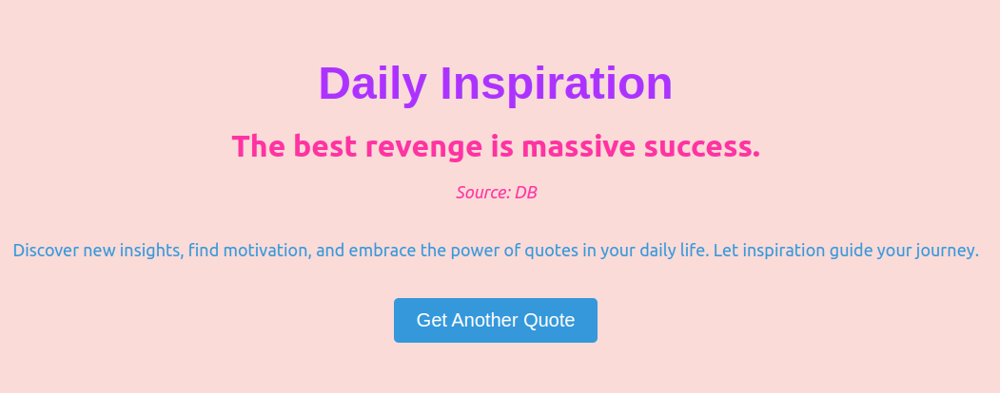

# Quotes Show

Quotes Show is a web application that displays random quotes of the day. It provides users with inspirational and thought-provoking quotes to start their day on a positive note. The project consists of a backend API built with Python and FastAPI, and a frontend UI developed using React.

## Project Overview

The Quotes Show project is designed to inspire and motivate users by providing them with random quotes of the day. The project consists of a backend and a frontend component.

### Backend
The backend of the Quotes Show project is responsible for fetching quotes from a PostgreSQL database and serving them through a RESTful API. The backend utilizes the PostgreSQL database to store quotes and Redis cache for caching quotes, reducing the need for frequent database requests.

### Frontend
The frontend component of the Quotes Show project is responsible for displaying the random quotes in an appealing and user-friendly manner. It interacts with the backend API to fetch the quotes and present them to the users.

## Run Project

1. Clone the repository:
```
git clone https://github.com/durbin-164/quotes_show.git
```

2. Navigate to the project directory:
```
cd quotes_show
```

3. Run with docker compose
```
docker-compose up
```
Or
```
 docker compose up
 ```

4. Access frondend:
```
http://localhost:3000/
```

5. [Optional] Access backend
```
http://localhost:8000/docs
```

## UI Screenshots



*Screenshot of the Quotes Show homepage displaying a random quote.*

## Project Architecture


## Technologies Used
### Backend
- Python
- Flask (Python web framework)
- PostgreSQL (database)
- Redis (cache)
### Frontend
- React.js
- HTML
- CSS


# Development 

## Installation

To run the Quotes Show project on your local machine, follow these steps:

### 1. Clone the repository:
```
git clone https://github.com/durbin-164/quotes_show.git
```

### 2. Navigate to the project directory:
```
cd quotes_show
```

### 3. Set up frontend:
- Navigate Frontend
    ```
    cd frontend
    ```
- Run dependency - make sure you have node js installed
    ```
    npm install
    ```

- Run the frontend:
    ```
    npm start
    ```


### 4. Set up the backend:
- Navigate backend
    ```
    cd backend
    ```
- Create a virtual environment:
  ```
  python -m venv venv
  ```
- Activate the virtual environment:
  - For Linux/Mac:
    ```
    source venv/bin/activate
    ```
  - For Windows:
    ```
    venv\Scripts\activate
    ```
- Install backend dependencies:
  ```
  pip install -r backend/requirements.txt
  ```

### 5. Set up the database and Redies:
- Start a PostgreSQL server and Redies with docker compose.
    ```
    docker-compose -f docker-compose.dev.yml up
    ```

### 6. Run the backend server:
  - 
    ```
    python app/run.py
    ```

### API Endpoints

- `GET /api/quote`: Fetches a random quote of the day.

## Medium Article

[Article link](https://medium.com/@masud.educations/building-quotes-show-a-web-application-for-daily-inspiration-1369dcedd8c7)

## Contributing

Contributions to the Quotes Show project are welcome! If you have any ideas, suggestions, or bug reports, please open an issue or submit a pull request.

## License

This project is licensed under the MIT License. See the [LICENSE](LICENSE) file for more information.

